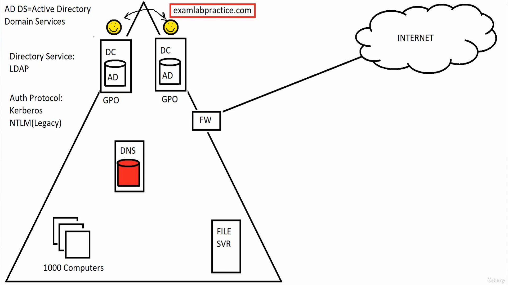
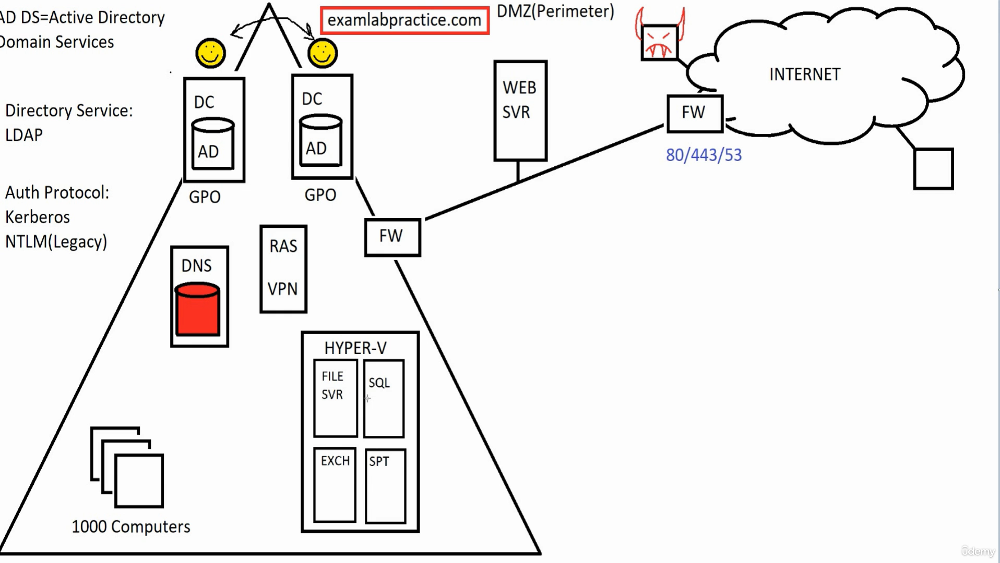
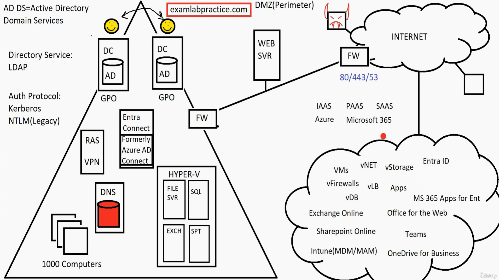

# Active Directory Domain Services (ADDS)

* Domain controllers --> Which have Active Directories (a database for domain controller)
    * A domain can have multiple Domain Controllers.
    * Any user account, or for that matter anything we do on one Domain Controller (DC) will be replicated to the others.
    * Now the machines inside the domain can authenticate to the DC using an authentication protocol.
    * Authentication protocol:
        * Kerberos
        * NTLM (Older)
    * AD uses a language called: Lightweight Directory Access Protocl (LDAP)
    * Domain Name System (DNS) server is the server inside the domain which links the domain to the internet. --> Linked to URL
    * Domain will also have a File Server.
    * Now the systems in the domain register their IPs to the DNS, these systems can query DNS to find out which address one of the DCs running on.
    * Each DC has their individual GPOs (Group Policy Object) --> Its functionality is to set the parameters/configurational attributes.
    *
    * 
      ______________________________________________________________________________
_______________________________________________________________________________________
 
   * 
***
***

  
    
  
