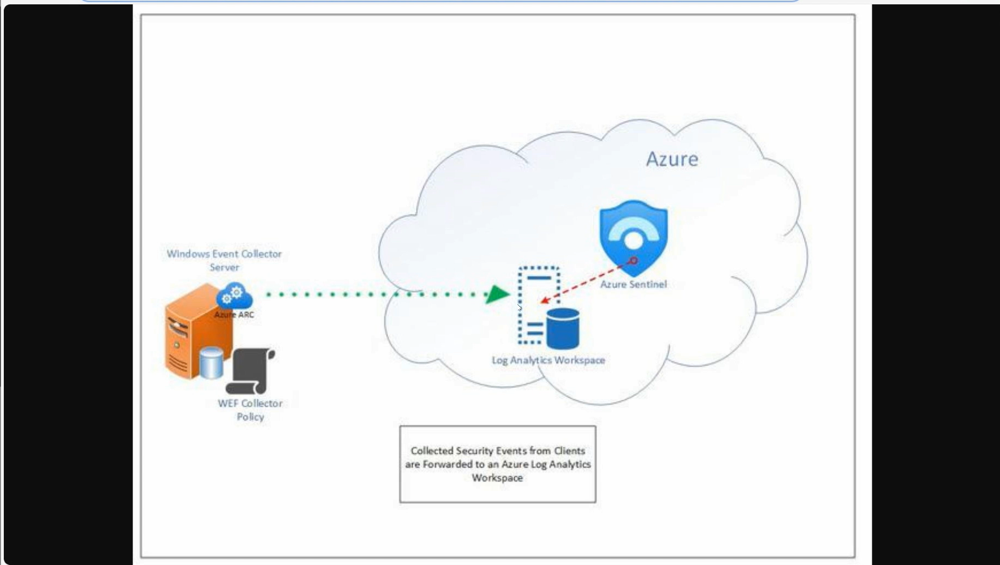

* Older way to collect data without "Defender for end points"
  
* 

* Connection of Senitnel with Windows Event Collector server

 ***

 * Using Defender for end points
     * "Content hub" --> Search for "Windows security" -->
     * Click "Windows Security Events"  --> "Install"
  
 * Go to "Data Connectors" --> Find the connector we just installed --> Open the connector page.
 * "Create data collection rule" --> Here's the step where we can link the virtual machine (that we started before setting this rule on Azure) to the "Windows Security Events" connector.
