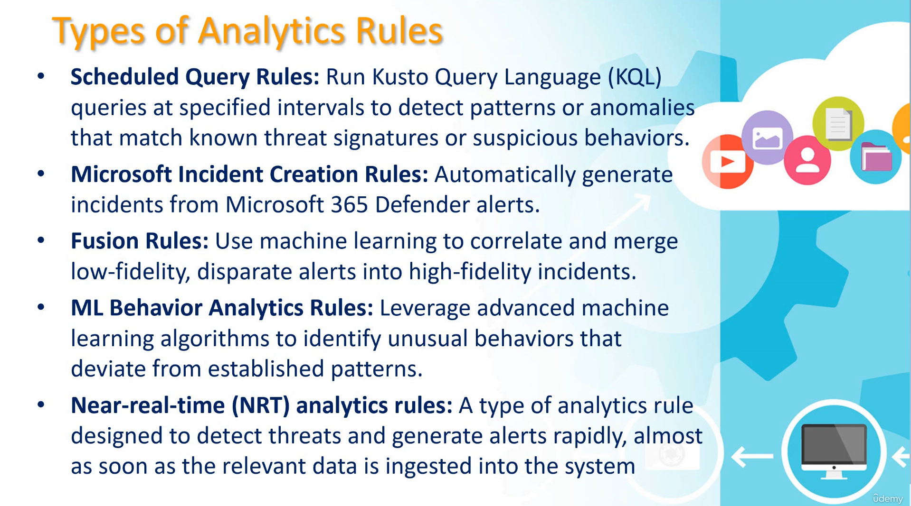
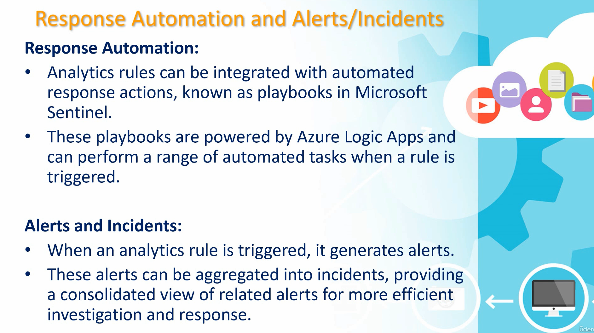

# Purpose
* These rules are designed to automatically detect potential security threats and anomalies by analyzing the vast amount of data collected in your environment.
* These rules help in identifying:
    * Suspicious activities
    * Unusual patterns
    * Known attack techniques
    * Other indicators of compromise (IOC)
 
* 
***
***
# Response Automation
* 

## Fusion rules
* Already configured
* This rule covers the following detections:
  * Fusion for emerging threats
  * Fusion for ransomware
  * Scenario-based Fusion detections (122 scenarios)
 
## Security analytics rules
* Create --> "Microsoft incident creation rule"
* Next step --> In "Automated response" --> "Add new"
* We may add "Severity, "Title" with "And" conditions.
* "Save"

## Scheduled Query rules
* These rules are generally written using KQL.
* Generally executed on a given interval.
* ***Custom Scheduled query rules***
    * "Analytics" --> "Create" --> "Scheduled Query rule"
    * We will create a demo rule that will look into any unkown sign-in attempt.
    * Write KQL as:
      * `SigninLogs_CL where ResultType == "Unfamiliar sign-in"`
     
    * Under "Alert enhancement" --> "Entity mapping" --> Add identifiers as "Account, name, AuthenticationDetails_s" and "IP, address, computer"
    * Then keep going until created.
 
## Near-real-time (NRT) analytics rule
* "analytics" --> "Create NRT rule"
* This rule is not checking based on time but every event happening
* May be under "Tactics and Techniques" add "Credential Access" to select NEXT then.
* KQL used:
    * `SigninLogs | where ResultType !in ("0", "50125", "50140") | project TimeGenerated, UserPrincipalName, Location, IPAddress, ResultType, ResultDescription`
 
* "Save"

## Content hub analytics rule
* Inside "Content hub" --> Filter the "Content type" to "Analytics rule" --> Then install one of the Rule Templates which would then be visible inside "Rule Templates" section under "Anlaytics".
* This template then can be used to create a rule.
***

# Watchlists
* Watchlists can be integrated into Azure Sentinel's detection rules and queries.
* When a security alert is triggered based on a detection rule or query that references a watchlist, analysts can quickly identify relevant information about the associated entities from the watchlist,
* helping them to prioritize and investigate the alert effectively.
* **Create a Watchlist**
    * In Sentinel, click "Watchlist" on the left menu.
    * We will need a .csv file to be used as a watchlist.
    * "New"

