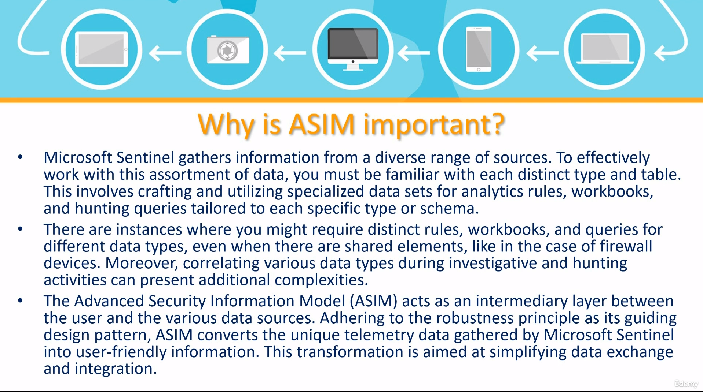

# Purpose of ASIM
*  

***
*  **Query time parsers**
  * ASIM employs parsers at query time to align existing data with the normalized schemas, utilizing KQL functions.
  * Sentinel provides numerous ASIM parsers as built-in features.

***
# ASIM parser management
* Sentinel --> "Logs" --> Write your query --> "Run"
* To save --> "Save" --> "Save as a function"

* Example
* 
### Scenario: Windows Security Event Logs

Windows Security Event logs often contain information about system activities like user logins, account changes, and system start-ups. The raw logs have a specific format, and the ASIM parser's job is to map these to a standardized schema for easier analysis in Azure Sentinel.

### Sample Windows Security Event Log Fields:
- `EventID`: The ID of the event (e.g., 4624 for a successful login).
- `TimeCreated`: Timestamp of when the event was logged.
- `AccountName`: Name of the account associated with the event.
- `IpAddress`: IP address from where the event originated (if applicable).

### Target ASIM Schema for Authentication Events:
- `TimeGenerated`: Standardized timestamp field.
- `Account`: Name of the account involved in the event.
- `Activity`: Description or ID of the activity (like login or logout).
- `SourceIP`: IP address from where the activity originated.

### Example ASIM Parser Function for Windows Security Events:

```kql
let WindowsSecurityEventParser = (WindowsSecurityEventTable: datatable) {
    WindowsSecurityEventTable
    | where EventID == 4624 // focusing on successful logins
    | extend TimeGenerated = todatetime(TimeCreated),
             Account = AccountName,
             Activity = 'Successful Login',
             SourceIP = IpAddress
};
```

### Steps to Test the Parser:

1. **Ingest Windows Security Event Logs**:
   - In Azure Sentinel, connect to your Windows event log source (like a domain controller).
   - Ensure the raw event log data is ingested into a table, e.g., `WindowsSecurityEventLogs`.

2. **Apply the Parser**:
   - Define the `WindowsSecurityEventParser` function in the KQL console.
   - Apply the parser to your Windows security event data:
     ```kql
     WindowsSecurityEventLogs
     | invoke WindowsSecurityEventParser()
     ```

3. **Analyze the Results**:
   - Execute KQL queries to view and analyze the parsed data.
   - Look for patterns, anomalies, or insights using the standardized ASIM fields.

This example focuses on a specific type of event (successful logins) for simplicity. In a real-world scenario, you might have a more complex parser handling various event types, providing a comprehensive view of security-related activities across your Windows environment. The key is that ASIM parsers help normalize diverse log data into a consistent format, simplifying analysis and threat detection.
